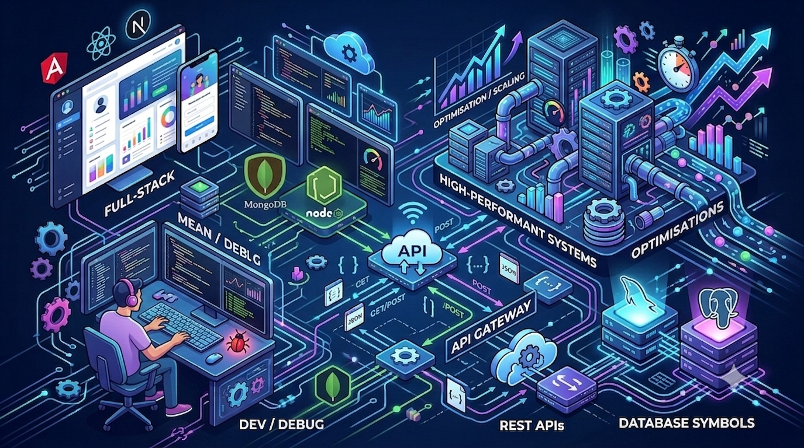

  

<h1 align="center">Hi, I'm Yaswanth 👋</h1>
<h3 align="center">Full-Stack Developer (MEAN | MERN | Next.js) — building high-performance, AI-integrated systems</h3>

  
  

  

<picture>
  <source
    media="(prefers-color-scheme: dark)"
    srcset="https://raw.githubusercontent.com/yaswanthsai002/yaswanthsai002/output/github-snake-dark.svg"
  />
  <source
    media="(prefers-color-scheme: light)"
    srcset="https://raw.githubusercontent.com/yaswanthsai002/yaswanthsai002/output/github-snake.svg"
  />
  
</picture>

---

### About me

I'm a Full-Stack Developer working mainly across the **MEAN stack** — Angular, Node.js, Express, MongoDB — with hands-on production experience in **React.js** and **Next.js** as well.

Most of my work sits in backend architecture and real-time systems: redesigning data pipelines to cut API latency, building event-driven platforms that handle scheduling and retries at scale, and wiring AI into product workflows — from analytics dashboards to prompt-driven automation.

I like the kind of problems where a backend decision shows up directly as a frontend performance win.

### What I'm currently doing

- 🔭 Building production systems at **Aptagrim** — Node.js/Express/MongoDB APIs and Angular frontends across client projects
- 🌱 Deepening **React.js / Next.js** through a live production codebase
- 🎯 Open to full-stack roles, India-based or remote
- 💬 Ask me about Angular, Node/Express API design, or MongoDB aggregation pipelines

### Tech I work with

  

### GitHub stats

  
  

  

