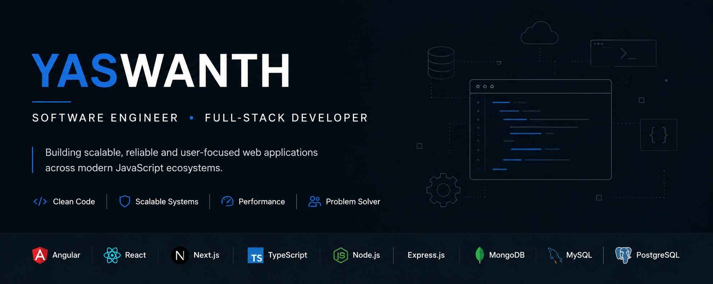

  

<h1 align="center">Hi, I'm Yaswanth</h1>

  <strong>Software Engineer · Full-Stack Developer</strong>

  Building production web applications across <strong>Angular, React, Next.js, Node.js</strong> and modern TypeScript stacks.

  
  
  

## About Me

I'm a **Software Engineer and Full-Stack Developer** working across modern frontend and backend ecosystems, with production experience building web applications using **Angular, React, Next.js, Node.js, Express.js and MongoDB**.

My work spans both sides of the application stack — from designing frontend experiences and reusable UI architecture to building REST APIs, backend services, data flows and integrations.

I enjoy working on engineering problems where **architecture, performance, maintainability and developer experience** matter as much as getting the feature shipped.

I'm currently expanding my depth across **full-stack engineering, data structures & algorithms, system design and scalable application architecture**, while remaining open to full-stack opportunities.

---

## Tech Stack

### Frontend

  

### Backend & APIs

  

### Databases

  

### Cloud & Tools

  

---

## Currently Focused On

* 🧩 Strengthening **Data Structures & Algorithms**
* 🏗️ Deepening **System Design & Software Architecture**
* ⚛️ Building deeper expertise across **React.js and Next.js**
* 🔧 Improving full-stack engineering depth across frontend, backend and databases
* ☁️ Expanding practical knowledge of **Docker and AWS**
* 🚀 Exploring opportunities to contribute to challenging **full-stack engineering roles**

---

## GitHub Analytics

  
  

  

---

## Connect

  
  

  <i>Open to full-stack engineering opportunities.</i>

